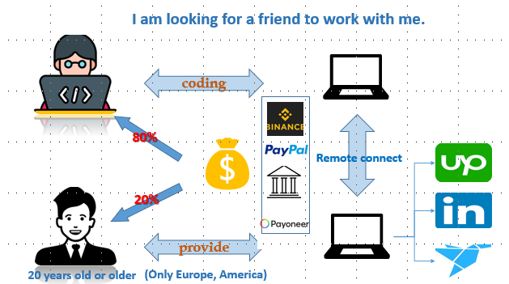
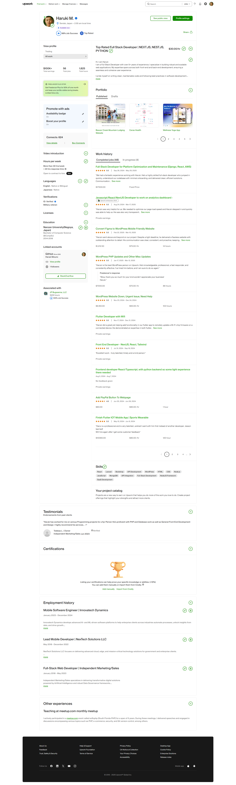

# Welcome to My Profile 👋

## Introduction
I am **Haruki Mizuno**, a **Mobile Full Stack** and **Trading System** Engineer with a passion for creating innovative solutions.

---

## 🚀 Experience Highlights
- **8 years** of coding experience
- **4 years** in mobile development
- **2 years** in trading systems
- Former 🌟**Top-Rated** Upwork freelancer with **98%** job success rate
- **$100K+** in earnings through freelance work

---

## 🎯 What I'm Looking For
I am seeking **long-term collaborators** to work together on exciting projects. I'm particularly interested in:
- Mobile app development projects
- Trading system implementations
- Full-stack development opportunities
- Innovative tech solutions

---

## 📞 Contact Me
Let's connect and discuss potential collaborations!

| Platform | Contact |
|----------|---------|
| 📞 **WhatsApp** | +1 (802) 771-7967 |
| 📱 **Telegram** | @bingma006 |
| 🗨 **Discord** | @haruki0624mizuno |
| 📧 **Email** | mizunoharuki0624@gmail.com |
| 🔗 **LinkedIn** | [Haruki Mizuno](https://www.linkedin.com/in/haruki-mizuno-6310a6365/) |

---

*Looking forward to working with you!* 🚀

